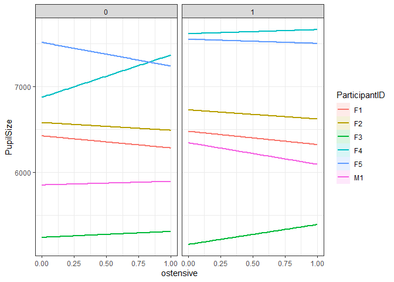
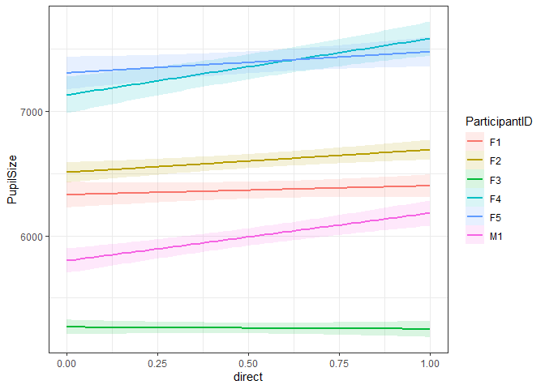
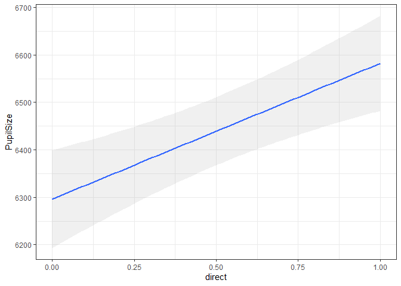

``` r
Samples <- read_csv("Exported_EyeLink_data/Cleaned/Samples_merged_Fabio.csv") %>% 
  mutate(GazeY = 1051-GazeY, Fix_MeanY = 1051-Fix_MeanY) %>% 
  filter(Time<=41202)
```

    ## Parsed with column specification:
    ## cols(
    ##   .default = col_double(),
    ##   ParticipantID = col_character(),
    ##   ParticipantGender = col_character(),
    ##   EyeTracked = col_character(),
    ##   Task = col_character(),
    ##   ForagingType = col_character(),
    ##   Stimulus = col_character(),
    ##   Video = col_logical(),
    ##   Sac_Blink = col_logical(),
    ##   Sac_Direction = col_character()
    ## )

    ## See spec(...) for full column specifications.

### Foraging Experiment

``` r
# Subset data so we only have foraging task
foraging <- subset(Samples, Task == 'Foraging')

# Subset data so we only have one row per fixation
Fix <- foraging[!is.na(foraging$FixationNo),] %>% # remember to remove NAs 
  group_by(ParticipantID, Trial) %>% 
  summarize(NFix = max(FixationNo),
            Task = Task[1], ParticipantGender = ParticipantGender[1], 
            Stimulus = Stimulus[1], ForagingType = ForagingType[1])

#Models
# Gaussian distribution
gau_m_fix <- glmer(NFix ~ 1 + ForagingType + (1+ForagingType|ParticipantID) + (1+ForagingType|Stimulus), 
               data = Fix,
               family = gaussian(link = 'identity'))

plot(gau_m_fix)
```


``` r
# Poisson distribution
poi_m_fix <- glmer(NFix ~ 1 + ForagingType + (1+ForagingType|ParticipantID) + (1+ForagingType|Stimulus), 
               data = Fix,
               family = poisson)
```

    ## boundary (singular) fit: see ?isSingular

``` r
plot(poi_m_fix)
```


``` r
# Predict
PredictGau_fix <- predict(gau_m_fix)
PredictPoi_fix <- predict(poi_m_fix)

plot(density(PredictGau_fix))
```


``` r
plot(density(PredictPoi_fix))
```


``` r
plot(density(Fix$NFix, na.rm = T))
```


``` r
#Residuals
dGau_fix <- DHARMa::simulateResiduals(gau_m_fix)
```

    ## Model family was recognized or set as continuous, but duplicate values were detected in the response. Consider if you are fitting an appropriate model.

``` r
plot(dGau_fix)
```


``` r
dPoi_fix <- DHARMa::simulateResiduals(poi_m_fix)
plot(dPoi_fix)
```


``` r
citation('DHARMa')
```

    ## 
    ## To cite package 'DHARMa' in publications use:
    ## 
    ##   Florian Hartig (2020). DHARMa: Residual Diagnostics for Hierarchical
    ##   (Multi-Level / Mixed) Regression Models. R package version 0.2.7.
    ##   https://CRAN.R-project.org/package=DHARMa
    ## 
    ## A BibTeX entry for LaTeX users is
    ## 
    ##   @Manual{,
    ##     title = {DHARMa: Residual Diagnostics for Hierarchical (Multi-Level / Mixed)
    ## Regression Models},
    ##     author = {Florian Hartig},
    ##     year = {2020},
    ##     note = {R package version 0.2.7},
    ##     url = {https://CRAN.R-project.org/package=DHARMa},
    ##   }

``` r
Sac <- foraging[!is.na(foraging$SaccadeNo),] %>% # remember to remove NAs 
  group_by(ParticipantID, Trial, SaccadeNo) %>% 
  summarize(Sac_Duration = mean(Sac_Duration, na.rm = T),
            Sac_Amplitude = mean(Sac_Amplitude, na.rm = T),
            Task = Task[1], ParticipantGender = ParticipantGender[1], 
            Stimulus = Stimulus[1], ForagingType = ForagingType[1])

#Models
# Gaussian distribution
gau_m <- glmer(Sac_Amplitude ~ 1 + ForagingType + (1+ForagingType|ParticipantID) + (1+ForagingType|Stimulus), 
               data = Sac,
               family = gaussian(link = 'identity'))

plot(gau_m)
```


``` r
# Lognormal distribution
log_m <- glmer(Sac_Amplitude ~ 1 + ForagingType + (1+ForagingType|ParticipantID) + (1+ForagingType|Stimulus), 
               data = Sac,
               family = gaussian(link = 'log'))
```

    ## boundary (singular) fit: see ?isSingular

``` r
plot(log_m)
```


``` r
# Predict
PredictGau <- predict(gau_m)
PredictLog <- predict(log_m)

plot(density(PredictGau))
```


``` r
plot(density(PredictLog))
```


``` r
plot(density(Sac$Sac_Amplitude, na.rm = T))
```


``` r
#Residuals
dGau <- DHARMa::simulateResiduals(gau_m)
```

    ## Model family was recognized or set as continuous, but duplicate values were detected in the response. Consider if you are fitting an appropriate model.

``` r
plot(dGau)
```


``` r
dLog <- DHARMa::simulateResiduals(log_m)
```

    ## Model family was recognized or set as continuous, but duplicate values were detected in the response. Consider if you are fitting an appropriate model.

``` r
plot(dLog)
```


``` r
#Summarise lognormal model
summary(log_m)
```

    ## Generalized linear mixed model fit by maximum likelihood (Laplace
    ##   Approximation) [glmerMod]
    ##  Family: gaussian  ( log )
    ## Formula: 
    ## Sac_Amplitude ~ 1 + ForagingType + (1 + ForagingType | ParticipantID) +  
    ##     (1 + ForagingType | Stimulus)
    ##    Data: Sac
    ## 
    ##      AIC      BIC   logLik deviance df.resid 
    ##  20434.4  20490.5 -10208.2  20416.4     3753 
    ## 
    ## Scaled residuals: 
    ##     Min      1Q  Median      3Q     Max 
    ## -1.5870 -0.6024 -0.3034  0.3149  6.2025 
    ## 
    ## Random effects:
    ##  Groups        Name               Variance Std.Dev. Corr
    ##  Stimulus      (Intercept)         0.0000  0.0000       
    ##                ForagingTypeSearch  0.3844  0.6200    NaN
    ##  ParticipantID (Intercept)         0.0000  0.0000       
    ##                ForagingTypeSearch  0.1257  0.3545    NaN
    ##  Residual                         13.0516  3.6127       
    ## Number of obs: 3762, groups:  Stimulus, 10; ParticipantID, 6
    ## 
    ## Fixed effects:
    ##                    Estimate Std. Error t value Pr(>|z|)    
    ## (Intercept)         0.92669    0.03553  26.082  < 2e-16 ***
    ## ForagingTypeSearch  0.53761    0.07907   6.799 1.05e-11 ***
    ## ---
    ## Signif. codes:  0 '***' 0.001 '**' 0.01 '*' 0.05 '.' 0.1 ' ' 1
    ## 
    ## Correlation of Fixed Effects:
    ##             (Intr)
    ## FrgngTypSrc -0.449
    ## convergence code: 0
    ## boundary (singular) fit: see ?isSingular

``` r
#The estimates are on a log-scale!
# Beta value for count
exp(0.92669)
```

    ## [1] 2.526134

``` r
# Beat value for search
exp(0.92669 + 0.53761) #because the intercept is 0.92669
```

    ## [1] 4.324515

``` r
MuMIn::r.squaredGLMM(log_m)
```

    ##              R2m       R2c
    ## [1,] 0.005284715 0.0269386

``` r
#The model doesn't explain a lot of variance. The finding might be significant, but it doesn't explain a lot of the eye movements by condition.....
```

### Social Engagement Task

``` r
# Subset data so we only have social engagement task
social <- subset(Samples, Task == 'SocialEngagement')

# Read logfile
social_log <- read_csv('logfiles_SocialEngagement/logfiles_SocialEngagement.csv')
```

    ## Parsed with column specification:
    ## cols(
    ##   Trial = col_double(),
    ##   ParticipantID = col_character(),
    ##   Video = col_character()
    ## )

``` r
# Merge
social <- merge(social, social_log, by = c('Trial','ParticipantID'))

# Create direction and ostensive variables 
social$direct <- ifelse(grepl('dir', social$Video.y), 1, 0)
social$ostensive <- ifelse(!grepl('-', social$Video.y),1,0)

social %>% 
  summarise(
    Ndirect = sum(direct),
    Nostensive = sum(ostensive)
  )
```

    ##   Ndirect Nostensive
    ## 1   77194      76925

``` r
#Plot
p_direct <- ggplot(social, aes(Time, PupilSize, color = ParticipantID)) +
  geom_smooth() + facet_wrap(.~direct, scales = "free_x") + ggtitle('Direct')
p_ostensive <- ggplot(social, aes(Time, PupilSize, color = ParticipantID)) +
  geom_smooth() + facet_wrap(.~ostensive, scales = "free_x") + ggtitle('Ostensive')

p_direct / p_ostensive
```

    ## `geom_smooth()` using method = 'gam' and formula 'y ~ s(x, bs = "cs")'

    ## `geom_smooth()` using method = 'gam' and formula 'y ~ s(x, bs = "cs")'


``` r
# Average pupilsize per fixation
pup <- social[!is.na(social$FixationNo),] %>% # remember to remove NAs 
  group_by(ParticipantID, Trial, FixationNo) %>% 
  summarize(PupilSize = mean(PupilSize, na.rm = T),
            Task = Task[1], ParticipantGender = ParticipantGender[1],
            direct = direct[1], ostensive = ostensive[1])

#Models
# Lognormal distribution
log_m2 <- glmer(PupilSize ~ 1 + direct*ostensive + (1+direct*ostensive|ParticipantID), 
               data = pup,
               family = gaussian(link = 'log'))
```

    ## boundary (singular) fit: see ?isSingular

``` r
log_m3 <- glmer(PupilSize ~ 1 + direct+ostensive + (1+direct+ostensive|ParticipantID), 
               data = pup,
               family = gaussian(link = 'log'))
```

    ## boundary (singular) fit: see ?isSingular

``` r
#Summarise lognormal model
summary(log_m2)
```

    ## Generalized linear mixed model fit by maximum likelihood (Laplace
    ##   Approximation) [glmerMod]
    ##  Family: gaussian  ( log )
    ## Formula: PupilSize ~ 1 + direct * ostensive + (1 + direct * ostensive |  
    ##     ParticipantID)
    ##    Data: pup
    ## 
    ##      AIC      BIC   logLik deviance df.resid 
    ##   8259.2   8323.9  -4114.6   8229.2      536 
    ## 
    ## Scaled residuals: 
    ##     Min      1Q  Median      3Q     Max 
    ## -3.2666 -0.5605  0.1479  0.6576  2.3291 
    ## 
    ## Random effects:
    ##  Groups        Name             Variance Std.Dev. Corr             
    ##  ParticipantID (Intercept)        2295.0  47.91                    
    ##                direct              247.8  15.74    0.15            
    ##                ostensive           223.0  14.93   -0.18  0.69      
    ##                direct:ostensive    235.0  15.33    0.08 -0.96 -0.82
    ##  Residual                       105924.4 325.46                    
    ## Number of obs: 551, groups:  ParticipantID, 6
    ## 
    ## Fixed effects:
    ##                    Estimate Std. Error t value Pr(>|z|)    
    ## (Intercept)       8.7824189  0.0694261 126.500   <2e-16 ***
    ## direct            0.0310701  0.0213863   1.453    0.146    
    ## ostensive         0.0001599  0.0204252   0.008    0.994    
    ## direct:ostensive -0.0042529  0.0222731  -0.191    0.849    
    ## ---
    ## Signif. codes:  0 '***' 0.001 '**' 0.01 '*' 0.05 '.' 0.1 ' ' 1
    ## 
    ## Correlation of Fixed Effects:
    ##             (Intr) direct ostnsv
    ## direct       0.104              
    ## ostensive   -0.220  0.686       
    ## dirct:stnsv  0.135 -0.918 -0.822
    ## convergence code: 0
    ## boundary (singular) fit: see ?isSingular

``` r
summary(log_m3)
```

    ## Generalized linear mixed model fit by maximum likelihood (Laplace
    ##   Approximation) [glmerMod]
    ##  Family: gaussian  ( log )
    ## Formula: PupilSize ~ 1 + direct + ostensive + (1 + direct + ostensive |  
    ##     ParticipantID)
    ##    Data: pup
    ## 
    ##      AIC      BIC   logLik deviance df.resid 
    ##   8206.4   8249.5  -4093.2   8186.4      541 
    ## 
    ## Scaled residuals: 
    ##     Min      1Q  Median      3Q     Max 
    ## -3.5233 -0.5883  0.0858  0.6533  2.6053 
    ## 
    ## Random effects:
    ##  Groups        Name        Variance  Std.Dev. Corr       
    ##  ParticipantID (Intercept)   1522.20  39.015             
    ##                direct          26.85   5.182   0.46      
    ##                ostensive       74.47   8.629  -0.21  0.77
    ##  Residual                  115068.14 339.217             
    ## Number of obs: 551, groups:  ParticipantID, 6
    ## 
    ## Fixed effects:
    ##              Estimate Std. Error t value Pr(>|z|)    
    ## (Intercept) 8.7560031  0.0469739 186.401  < 2e-16 ***
    ## direct      0.0294339  0.0074568   3.947 7.91e-05 ***
    ## ostensive   0.0000526  0.0105791   0.005    0.996    
    ## ---
    ## Signif. codes:  0 '***' 0.001 '**' 0.01 '*' 0.05 '.' 0.1 ' ' 1
    ## 
    ## Correlation of Fixed Effects:
    ##           (Intr) direct
    ## direct     0.371       
    ## ostensive -0.205  0.526
    ## convergence code: 0
    ## boundary (singular) fit: see ?isSingular

``` r
#The estimates are on a log-scale!

#variance explained
MuMIn::r.squaredGLMM(log_m2)
```

    ##               R2m       R2c
    ## [1,] 1.980819e-09 0.0229272

``` r
MuMIn::r.squaredGLMM(log_m3)
```

    ##               R2m        R2c
    ## [1,] 1.858174e-09 0.01385158

``` r
#Spaghetti plot
# with interaction
social %>% ggplot(aes(ostensive, PupilSize, group = ParticipantID, color = ParticipantID,labs = T)) +
  facet_wrap(.~direct) + 
  geom_smooth(method = "lm", se = TRUE, alpha = .15, aes(fill = ParticipantID))
```



``` r
# Only for direct/averted
pup %>% ggplot(aes(direct, PupilSize, group = ParticipantID, color = ParticipantID,labs = T)) +
  geom_smooth(method = "lm", se = TRUE, alpha = .15, aes(fill = ParticipantID))
```



``` r
ggplot(aes(x = direct, y = PupilSize), data = pup) + geom_smooth(method = 'lm', se = T, alpha = .15)
```


