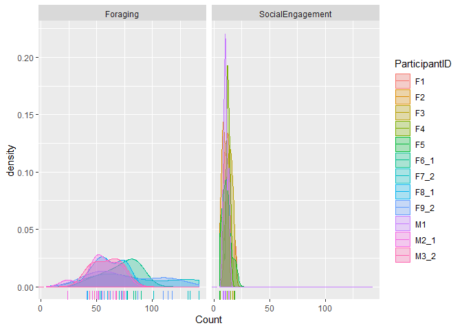
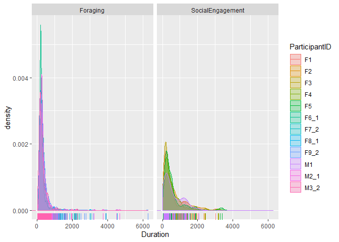

``` r
## Load sample data for both experiments
Foraging_Samples <- read_csv('Exported_EyeLink_data/Foraging_Samples.csv')
```

    ## Parsed with column specification:
    ## cols(
    ##   .default = col_character(),
    ##   TRIAL_INDEX = col_double(),
    ##   TIMESTAMP = col_double(),
    ##   IP_DURATION = col_double(),
    ##   IP_END_TIME = col_double(),
    ##   IP_START_TIME = col_double(),
    ##   LEFT_IN_BLINK = col_double(),
    ##   LEFT_IN_SACCADE = col_double(),
    ##   RESOLUTION_X = col_double(),
    ##   RESOLUTION_Y = col_double(),
    ##   SAMPLE_INDEX = col_double(),
    ##   TRIAL_START_TIME = col_double(),
    ##   LEFT_GAZE_X = col_double(),
    ##   LEFT_GAZE_Y = col_double(),
    ##   LEFT_PUPIL_SIZE = col_double()
    ## )

    ## See spec(...) for full column specifications.

``` r
SocialEngagement_Samples <- read_csv('Exported_EyeLink_data/SocialEngagement_Samples.csv')
```

    ## Parsed with column specification:
    ## cols(
    ##   .default = col_character(),
    ##   TRIAL_INDEX = col_double(),
    ##   TIMESTAMP = col_double(),
    ##   RIGHT_GAZE_X = col_double(),
    ##   RIGHT_GAZE_Y = col_double(),
    ##   RIGHT_PUPIL_SIZE = col_double(),
    ##   IP_DURATION = col_double(),
    ##   IP_END_TIME = col_double(),
    ##   IP_START_TIME = col_double(),
    ##   RESOLUTION_X = col_double(),
    ##   RESOLUTION_Y = col_double(),
    ##   RIGHT_IN_BLINK = col_double(),
    ##   RIGHT_IN_SACCADE = col_double(),
    ##   SAMPLE_INDEX = col_double(),
    ##   TRIAL_START_TIME = col_double()
    ## )
    ## See spec(...) for full column specifications.

``` r
## Load fixations data for both experiments
Foraging_Fixations <- read_csv('Exported_EyeLink_data/Foraging_Fixations.csv')
```

    ## Parsed with column specification:
    ## cols(
    ##   .default = col_character(),
    ##   TRIAL_INDEX = col_double(),
    ##   CURRENT_FIX_INDEX = col_double(),
    ##   CURRENT_FIX_DURATION = col_double(),
    ##   CURRENT_FIX_START = col_double(),
    ##   CURRENT_FIX_END = col_double(),
    ##   CURRENT_FIX_PUPIL = col_double(),
    ##   CURRENT_FIX_X = col_double(),
    ##   CURRENT_FIX_Y = col_double(),
    ##   CURRENT_FIX_ADJUSTED = col_logical(),
    ##   CURRENT_FIX_IS_RT_END = col_logical(),
    ##   CURRENT_FIX_MSG_COUNT = col_double(),
    ##   CURRENT_FIX_X_RESOLUTION = col_double(),
    ##   CURRENT_FIX_Y_RESOLUTION = col_double(),
    ##   IP_END_TIME = col_double(),
    ##   IP_START_TIME = col_double(),
    ##   TRIAL_FIXATION_TOTAL = col_double(),
    ##   TRIAL_START_TIME = col_double()
    ## )
    ## See spec(...) for full column specifications.

``` r
SocialEngagement_Fixations <- read_csv('Exported_EyeLink_data/SocialEngagement_Fixations.csv')
```

    ## Parsed with column specification:
    ## cols(
    ##   .default = col_character(),
    ##   TRIAL_INDEX = col_double(),
    ##   CURRENT_FIX_INDEX = col_double(),
    ##   CURRENT_FIX_DURATION = col_double(),
    ##   CURRENT_FIX_START = col_double(),
    ##   CURRENT_FIX_END = col_double(),
    ##   CURRENT_FIX_PUPIL = col_double(),
    ##   CURRENT_FIX_X = col_double(),
    ##   CURRENT_FIX_Y = col_double(),
    ##   CURRENT_FIX_ADJUSTED = col_logical(),
    ##   CURRENT_FIX_IS_RT_END = col_logical(),
    ##   CURRENT_FIX_MSG_COUNT = col_double(),
    ##   CURRENT_FIX_X_RESOLUTION = col_double(),
    ##   CURRENT_FIX_Y_RESOLUTION = col_double(),
    ##   IP_END_TIME = col_double(),
    ##   IP_START_TIME = col_double(),
    ##   TRIAL_FIXATION_TOTAL = col_double(),
    ##   TRIAL_START_TIME = col_double()
    ## )
    ## See spec(...) for full column specifications.

``` r
## Load saccades data for both experiments
Foraging_Saccades <- read_csv('Exported_EyeLink_data/Foraging_Saccades.csv')
```

    ## Parsed with column specification:
    ## cols(
    ##   .default = col_character(),
    ##   TRIAL_INDEX = col_double(),
    ##   TRIAL_START_TIME = col_double(),
    ##   CURRENT_SAC_INDEX = col_double(),
    ##   CURRENT_SAC_DURATION = col_double(),
    ##   CURRENT_SAC_START_TIME = col_double(),
    ##   CURRENT_SAC_END_TIME = col_double(),
    ##   CURRENT_SAC_START_X = col_double(),
    ##   CURRENT_SAC_START_Y = col_double(),
    ##   CURRENT_SAC_END_X = col_double(),
    ##   CURRENT_SAC_END_Y = col_double(),
    ##   CURRENT_SAC_AMPLITUDE = col_double(),
    ##   CURRENT_SAC_AVG_VELOCITY = col_double(),
    ##   CURRENT_SAC_PEAK_VELOCITY = col_double(),
    ##   CURRENT_SAC_CONTAINS_BLINK = col_logical(),
    ##   CURRENT_SAC_ANGLE = col_double(),
    ##   CURRENT_SAC_ADJUSTED = col_logical(),
    ##   CURRENT_SAC_END_X_RESOLUTION = col_double(),
    ##   CURRENT_SAC_END_Y_RESOLUTION = col_double(),
    ##   CURRENT_SAC_IS_RT_END = col_logical(),
    ##   CURRENT_SAC_MSG_COUNT = col_double()
    ##   # ... with 26 more columns
    ## )
    ## See spec(...) for full column specifications.

    ## Warning: 6 parsing failures.
    ##  row                      col expected actual                                          file
    ## 2324 CURRENT_SAC_AMPLITUDE    a double      . 'Exported_EyeLink_data/Foraging_Saccades.csv'
    ## 2324 CURRENT_SAC_AVG_VELOCITY a double      . 'Exported_EyeLink_data/Foraging_Saccades.csv'
    ## 2324 CURRENT_SAC_ANGLE        a double      . 'Exported_EyeLink_data/Foraging_Saccades.csv'
    ## 3711 CURRENT_SAC_AMPLITUDE    a double      . 'Exported_EyeLink_data/Foraging_Saccades.csv'
    ## 3711 CURRENT_SAC_AVG_VELOCITY a double      . 'Exported_EyeLink_data/Foraging_Saccades.csv'
    ## .... ........................ ........ ...... .............................................
    ## See problems(...) for more details.

``` r
SocialEngagement_Saccades <- read_csv('Exported_EyeLink_data/SocialEngagement_Saccades.csv')
```

    ## Parsed with column specification:
    ## cols(
    ##   .default = col_character(),
    ##   TRIAL_INDEX = col_double(),
    ##   TRIAL_START_TIME = col_double(),
    ##   CURRENT_SAC_INDEX = col_double(),
    ##   CURRENT_SAC_DURATION = col_double(),
    ##   CURRENT_SAC_START_TIME = col_double(),
    ##   CURRENT_SAC_END_TIME = col_double(),
    ##   CURRENT_SAC_START_X = col_double(),
    ##   CURRENT_SAC_START_Y = col_double(),
    ##   CURRENT_SAC_PEAK_VELOCITY = col_double(),
    ##   CURRENT_SAC_CONTAINS_BLINK = col_logical(),
    ##   CURRENT_SAC_ADJUSTED = col_logical(),
    ##   CURRENT_SAC_END_X_RESOLUTION = col_double(),
    ##   CURRENT_SAC_END_Y_RESOLUTION = col_double(),
    ##   CURRENT_SAC_IS_RT_END = col_logical(),
    ##   CURRENT_SAC_MSG_COUNT = col_double(),
    ##   CURRENT_SAC_PEAK_VELOCITY_TIME = col_double(),
    ##   CURRENT_SAC_START_X_RESOLUTION = col_double(),
    ##   CURRENT_SAC_START_Y_RESOLUTION = col_double(),
    ##   IP_END_TIME = col_double(),
    ##   IP_START_TIME = col_double()
    ##   # ... with 11 more columns
    ## )
    ## See spec(...) for full column specifications.

``` r
## We have made a small function to make things easier for your.
## What does the function do?

Add_Info <- function(df){
  
  df$Task[grepl("_",df$RECORDING_SESSION_LABEL)]='Foraging'
  df$Task[!grepl("_",df$RECORDING_SESSION_LABEL)]='SocialEngagement'
  
  df$ParticipantGender[grepl("F",df$RECORDING_SESSION_LABEL)]='Female'
  df$ParticipantGender[grepl("M",df$RECORDING_SESSION_LABEL)]='Male'
  
  df$SearchOrder[grepl("_1",df$RECORDING_SESSION_LABEL)]=1
  df$SearchOrder[grepl("_2",df$RECORDING_SESSION_LABEL)]=2
  
  return(df)
}

## Run the function on the datasets
Foraging_Samples <- Add_Info(Foraging_Samples) 
```

    ## Warning: Unknown or uninitialised column: 'Task'.

    ## Warning: Unknown or uninitialised column: 'ParticipantGender'.

    ## Warning: Unknown or uninitialised column: 'SearchOrder'.

``` r
Foraging_Fixations <- Add_Info(Foraging_Fixations) 
```

    ## Warning: Unknown or uninitialised column: 'Task'.

    ## Warning: Unknown or uninitialised column: 'ParticipantGender'.

    ## Warning: Unknown or uninitialised column: 'SearchOrder'.

``` r
Foraging_Saccades <- Add_Info(Foraging_Saccades)
```

    ## Warning: Unknown or uninitialised column: 'Task'.

    ## Warning: Unknown or uninitialised column: 'ParticipantGender'.

    ## Warning: Unknown or uninitialised column: 'SearchOrder'.

``` r
SocialEngagement_Samples <- Add_Info(SocialEngagement_Samples)
```

    ## Warning: Unknown or uninitialised column: 'Task'.

    ## Warning: Unknown or uninitialised column: 'ParticipantGender'.

    ## Warning: Unknown or uninitialised column: 'SearchOrder'.

``` r
SocialEngagement_Fixations <- Add_Info(SocialEngagement_Fixations)
```

    ## Warning: Unknown or uninitialised column: 'Task'.

    ## Warning: Unknown or uninitialised column: 'ParticipantGender'.

    ## Warning: Unknown or uninitialised column: 'SearchOrder'.

``` r
SocialEngagement_Saccades <- Add_Info(SocialEngagement_Saccades)
```

    ## Warning: Unknown or uninitialised column: 'Task'.

    ## Warning: Unknown or uninitialised column: 'ParticipantGender'.

    ## Warning: Unknown or uninitialised column: 'SearchOrder'.

``` r
## Use rbind() to make collapse across experiments
Samples <- rbind(Foraging_Samples, SocialEngagement_Samples)
Fixations <- rbind(Foraging_Fixations, SocialEngagement_Fixations)
Saccades <- rbind(Foraging_Saccades, SocialEngagement_Saccades) 
```

``` r
Samples = Samples %>% 
  select(
    ParticipantID=RECORDING_SESSION_LABEL,
    Trial=TRIAL_INDEX,
    Time=TIMESTAMP,
    LeftGazeX=LEFT_GAZE_X,
    LeftGazeY=LEFT_GAZE_Y,
    RightGazeX=RIGHT_GAZE_X,
    RightGazeY=RIGHT_GAZE_Y,
    LeftPupilSize=LEFT_PUPIL_SIZE,
    RightPupilSize=RIGHT_PUPIL_SIZE,
    Task,
    ParticipantGender,
    SearchOrder
    ) 

Fixations = Fixations %>% 
  select(
    ParticipantID=RECORDING_SESSION_LABEL,
    Trial=TRIAL_INDEX,
    FixationNo=CURRENT_FIX_INDEX,
    StartTime=CURRENT_FIX_START,
    EndTime=CURRENT_FIX_END,
    Duration=CURRENT_FIX_DURATION,
    PositionX=CURRENT_FIX_X,
    PositionY=CURRENT_FIX_Y,
    PupilSize=CURRENT_FIX_PUPIL,
    EyeUsed=EYE_USED,
    Task,
    ParticipantGender,
    SearchOrder
    ) 

Saccades = Saccades %>%
  select(
    ParticipantID=RECORDING_SESSION_LABEL,
    Trial=TRIAL_INDEX,
    SaccadeNo=CURRENT_SAC_INDEX,
    StartTime=CURRENT_SAC_START_TIME,
    EndTime=CURRENT_SAC_END_TIME,
    Duration=CURRENT_SAC_DURATION,
    StartX=CURRENT_SAC_START_X,
    StartY=CURRENT_SAC_START_Y,
    EndX=CURRENT_SAC_END_X,
    EndY=CURRENT_SAC_END_Y,
    PeakVelocity=CURRENT_SAC_PEAK_VELOCITY,
    MeanVelocity=CURRENT_SAC_AVG_VELOCITY,
    Blink=CURRENT_SAC_CONTAINS_BLINK,
    Direction=CURRENT_SAC_DIRECTION,
    Amplitude=CURRENT_SAC_AMPLITUDE,
    EyeUsed=EYE_USED,
    Task,
    ParticipantGender,
    SearchOrder)
```

``` r
#Changing the missing values from . to NA
Samples[Samples == "."] <- NA

Samples <- Samples %>% 
  mutate(
    #Making combined gaze rows for x and y (instead of different ones for left and right eye)
    GazeX = ifelse(is.na(RightGazeX), LeftGazeX,RightGazeX),
    GazeY = ifelse(is.na(RightGazeY), LeftGazeY,RightGazeY),
    #Making combined pupil size
    PupilSize = ifelse(is.na(RightPupilSize), LeftPupilSize, RightPupilSize)
  )

#Remove the left/right columns
Samples <- subset(Samples, select = -c(RightGazeX, RightGazeY, LeftGazeX, LeftGazeY, RightPupilSize, LeftPupilSize))
```

``` r
## The problem is that Excel (which we have used to export the data to CSV) adds two extra zeros
## to each number, then transforms it into a character *facepalm*.
## So each variable below has to bee transformed to a numeric, then divided by 100 to remove
## the extra zeros

# Samples <- Samples %>% 
#   group_by(ParticipantID, Trial) %>% 
#   mutate(Time = (Time-Time[1])/100,
#          LeftGazeX = as.numeric(LeftGazeX)/100,
#          LeftGazeY = as.numeric(LeftGazeY)/100,
#          RightGazeX = as.numeric(RightGazeX)/100,
#          RightGazeY = as.numeric(RightGazeY)/100,
#          LeftPupilSize = as.numeric(LeftPupilSize)/100,
#          RightPupilSize = as.numeric(RightPupilSize)/100)

Samples <- Samples %>% 
  group_by(ParticipantID, Trial) %>% 
  mutate(Time = (Time-Time[1])/100,
         GazeX = as.numeric(GazeX)/100,
         GazeY = as.numeric(GazeY)/100,
         PupilSize = as.numeric(PupilSize)/100
         )
```

    ## Warning: NAs introduced by coercion

    ## Warning: NAs introduced by coercion

    ## Warning: NAs introduced by coercion

    ## Warning: NAs introduced by coercion

    ## Warning: NAs introduced by coercion

    ## Warning: NAs introduced by coercion

    ## Warning: NAs introduced by coercion

    ## Warning: NAs introduced by coercion

    ## Warning: NAs introduced by coercion

    ## Warning: NAs introduced by coercion

    ## Warning: NAs introduced by coercion

    ## Warning: NAs introduced by coercion

    ## Warning: NAs introduced by coercion

    ## Warning: NAs introduced by coercion

    ## Warning: NAs introduced by coercion

    ## Warning: NAs introduced by coercion

    ## Warning: NAs introduced by coercion

    ## Warning: NAs introduced by coercion

    ## Warning: NAs introduced by coercion

    ## Warning: NAs introduced by coercion

    ## Warning: NAs introduced by coercion

    ## Warning: NAs introduced by coercion

    ## Warning: NAs introduced by coercion

    ## Warning: NAs introduced by coercion

    ## Warning: NAs introduced by coercion

    ## Warning: NAs introduced by coercion

    ## Warning: NAs introduced by coercion

    ## Warning: NAs introduced by coercion

    ## Warning: NAs introduced by coercion

    ## Warning: NAs introduced by coercion

    ## Warning: NAs introduced by coercion

    ## Warning: NAs introduced by coercion

    ## Warning: NAs introduced by coercion

    ## Warning: NAs introduced by coercion

    ## Warning: NAs introduced by coercion

    ## Warning: NAs introduced by coercion

    ## Warning: NAs introduced by coercion

    ## Warning: NAs introduced by coercion

    ## Warning: NAs introduced by coercion

    ## Warning: NAs introduced by coercion

    ## Warning: NAs introduced by coercion

    ## Warning: NAs introduced by coercion

    ## Warning: NAs introduced by coercion

    ## Warning: NAs introduced by coercion

    ## Warning: NAs introduced by coercion

    ## Warning: NAs introduced by coercion

    ## Warning: NAs introduced by coercion

    ## Warning: NAs introduced by coercion

    ## Warning: NAs introduced by coercion

    ## Warning: NAs introduced by coercion

    ## Warning: NAs introduced by coercion

    ## Warning: NAs introduced by coercion

    ## Warning: NAs introduced by coercion

    ## Warning: NAs introduced by coercion

    ## Warning: NAs introduced by coercion

    ## Warning: NAs introduced by coercion

    ## Warning: NAs introduced by coercion

    ## Warning: NAs introduced by coercion

    ## Warning: NAs introduced by coercion

    ## Warning: NAs introduced by coercion

    ## Warning: NAs introduced by coercion

    ## Warning: NAs introduced by coercion

    ## Warning: NAs introduced by coercion

    ## Warning: NAs introduced by coercion

    ## Warning: NAs introduced by coercion

    ## Warning: NAs introduced by coercion

    ## Warning: NAs introduced by coercion

    ## Warning: NAs introduced by coercion

    ## Warning: NAs introduced by coercion

    ## Warning: NAs introduced by coercion

    ## Warning: NAs introduced by coercion

    ## Warning: NAs introduced by coercion

    ## Warning: NAs introduced by coercion

    ## Warning: NAs introduced by coercion

    ## Warning: NAs introduced by coercion

    ## Warning: NAs introduced by coercion

    ## Warning: NAs introduced by coercion

    ## Warning: NAs introduced by coercion

    ## Warning: NAs introduced by coercion

    ## Warning: NAs introduced by coercion

    ## Warning: NAs introduced by coercion

    ## Warning: NAs introduced by coercion

    ## Warning: NAs introduced by coercion

    ## Warning: NAs introduced by coercion

    ## Warning: NAs introduced by coercion

    ## Warning: NAs introduced by coercion

    ## Warning: NAs introduced by coercion

    ## Warning: NAs introduced by coercion

    ## Warning: NAs introduced by coercion

    ## Warning: NAs introduced by coercion

    ## Warning: NAs introduced by coercion

    ## Warning: NAs introduced by coercion

    ## Warning: NAs introduced by coercion

    ## Warning: NAs introduced by coercion

    ## Warning: NAs introduced by coercion

    ## Warning: NAs introduced by coercion

    ## Warning: NAs introduced by coercion

    ## Warning: NAs introduced by coercion

    ## Warning: NAs introduced by coercion

    ## Warning: NAs introduced by coercion

    ## Warning: NAs introduced by coercion

    ## Warning: NAs introduced by coercion

    ## Warning: NAs introduced by coercion

    ## Warning: NAs introduced by coercion

    ## Warning: NAs introduced by coercion

    ## Warning: NAs introduced by coercion

    ## Warning: NAs introduced by coercion

    ## Warning: NAs introduced by coercion

    ## Warning: NAs introduced by coercion

    ## Warning: NAs introduced by coercion

    ## Warning: NAs introduced by coercion

    ## Warning: NAs introduced by coercion

    ## Warning: NAs introduced by coercion

    ## Warning: NAs introduced by coercion

    ## Warning: NAs introduced by coercion

    ## Warning: NAs introduced by coercion

    ## Warning: NAs introduced by coercion

``` r
Fixations <- Fixations %>% 
  mutate(PositionX = as.numeric(PositionX)/100,
         PositionY = as.numeric(PositionY)/100,
         PupilSize = as.numeric(PupilSize)/100)

Saccades <- Saccades %>% 
  mutate(StartX = as.numeric(StartX)/100,
         StartY = as.numeric(StartY)/100,
         EndX = as.numeric(EndX)/100,
         EndY =as.numeric(EndY)/100,
         PeakVelocity = as.numeric(PeakVelocity)/100,
         ## this is just because the MeanVelocity columns has commas instead of points
         MeanVelocity = as.numeric(gsub(";", ".", MeanVelocity)))
```

    ## Warning: NAs introduced by coercion

    ## Warning: NAs introduced by coercion

    ## Warning: NAs introduced by coercion

Merge with PsychoPy logfiles
----------------------------

``` r
## For the Foraging task using the left_join() function
logfiles_Foraging <- read.csv('logfiles_Foraging/ForagingOrder.csv')
Samples <- left_join(Samples, logfiles_Foraging, by = c("Trial", "SearchOrder")) 
# Joining, by = c("Trial", "SearchOrder")

## For the Social Engagement task using the left_join() function
logfiles_SocialEngagement <- read.csv('logfiles_SocialEngagement/logfiles_SocialEngagement.csv')
Samples <- left_join(Samples, logfiles_SocialEngagement, by = c("ParticipantID", "Trial")) 
```

    ## Warning: Column `ParticipantID` joining character vector and factor, coercing
    ## into character vector

``` r
# Joining, by = c("ParticipantID", "Trial")
```

``` r
write_csv(Samples, "Exported_EyeLink_data/Cleaned/Samples.csv")
write_csv(Fixations, "Exported_EyeLink_data/Cleaned/Fixations.csv")
write_csv(Saccades, "Exported_EyeLink_data/Cleaned/Saccades.csv")
```

Import fixation number and saccade number from processed data to samples
------------------------------------------------------------------------

``` r
## WARNING: THIS MAY TAKE A WHILE!

for (t in seq(nrow(Fixations))){
  StartTime=Fixations$StartTime[t]
  EndTime=Fixations$EndTime[t]
  ID=Fixations$ParticipantID[t]
  Trial=Fixations$Trial[t]
  FixN=Fixations$FixationNo[t]
  Samples$FixationNo[Samples$Time >= StartTime  & Samples$Time <= EndTime & Samples$ParticipantID==ID & Samples$Trial==Trial]=FixN
}
```

    ## Warning: Unknown or uninitialised column: 'FixationNo'.

``` r
for (t in seq(nrow(Saccades))){
  StartTime=Saccades$StartTime[t]
  EndTime=Saccades$EndTime[t]
  ID=Saccades$ParticipantID[t]
  Trial=Saccades$Trial[t]
  SacN=Saccades$SaccadeNo[t]
  Samples$SaccadeNo[Samples$Time >= StartTime  & Samples$Time <= EndTime & Samples$ParticipantID==ID & Samples$Trial==Trial]=SacN
}
```

    ## Warning: Unknown or uninitialised column: 'SaccadeNo'.

``` r
write_csv(Samples, "Exported_EyeLink_data/Cleaned/Samples_merged_self.csv")
```

``` r
#Load merged data
Samples_merged <- read_csv('Exported_EyeLink_data/Cleaned/Samples_merged_Fabio.csv')
```

    ## Parsed with column specification:
    ## cols(
    ##   .default = col_double(),
    ##   ParticipantID = col_character(),
    ##   ParticipantGender = col_character(),
    ##   EyeTracked = col_character(),
    ##   Task = col_character(),
    ##   ForagingType = col_character(),
    ##   Stimulus = col_character(),
    ##   Video = col_logical(),
    ##   Sac_Blink = col_logical(),
    ##   Sac_Direction = col_character()
    ## )

    ## See spec(...) for full column specifications.

    ## Warning: 154090 parsing failures.
    ##    row   col           expected         actual                                                     file
    ## 681701 Video 1/0/T/F/TRUE/FALSE m_pl_o1_div_+o 'Exported_EyeLink_data/Cleaned/Samples_merged_Fabio.csv'
    ## 681702 Video 1/0/T/F/TRUE/FALSE m_pl_o1_div_+o 'Exported_EyeLink_data/Cleaned/Samples_merged_Fabio.csv'
    ## 681703 Video 1/0/T/F/TRUE/FALSE m_pl_o1_div_+o 'Exported_EyeLink_data/Cleaned/Samples_merged_Fabio.csv'
    ## 681704 Video 1/0/T/F/TRUE/FALSE m_pl_o1_div_+o 'Exported_EyeLink_data/Cleaned/Samples_merged_Fabio.csv'
    ## 681705 Video 1/0/T/F/TRUE/FALSE m_pl_o1_div_+o 'Exported_EyeLink_data/Cleaned/Samples_merged_Fabio.csv'
    ## ...... ..... .................. .............. ........................................................
    ## See problems(...) for more details.

SANITY CHECKS
=============

``` r
## Check distribution of fixations
# Number of fixations
FixN <- Samples_merged %>% 
  group_by(ParticipantID, Trial, Task) %>% 
  dplyr::summarise(
    Count = max(FixationNo, na.rm=TRUE)
  )

ggplot(FixN, aes(Count, color = ParticipantID, fill = ParticipantID))+
  geom_density(alpha = .3)+
  facet_wrap(.~Task)+
  geom_rug(aes(x = Count, y = 0))
```



``` r
# Fixation duration
FixD <- Samples_merged[!is.na(Samples_merged$FixationNo),] %>% 
  #subset(!is.na(FixationNo)) %>% => another way of doing it
  group_by(Task, ParticipantID, Trial, FixationNo) %>% 
  dplyr::summarise(
    Duration = max(Time, na.rm = T)-min(Time, na.rm = T)
  )

ggplot(FixD, aes(Duration, color = ParticipantID, fill = ParticipantID))+
  geom_density(alpha = .3)+
  facet_wrap(.~Task)+
  geom_rug(aes(x = Duration, y = 0))
```



``` r
## Check distribution of saccades


## Remove all the data points that fall outside of the screen coordinates
## (1680, 1050), since these are artefacts


## Check distribution of pupil sizes for the Social Engagement task
```

``` r
## Check for outliers in fixation durations using a boxplot


## Check for outliers in saccade velocity using a boxplot
```

MAKE SOME PRELIMINARY VISUALIZATIONS TO EYEBALL THE DATA
========================================================

``` r
## Make a plot using geom_point and geom_line to visualize fixation duration
## in the two experiments
```

``` r
## Make a plot using geom_point and geom_line to visualize saccade amplitude
## in the two experiments
```

``` r
## Make a density plot visualizing pupil size by gender and by experiment
```

SOME MORE ADVANCED VISUALIZATIONS
=================================

Heatmaps
--------

``` r
## Make a heatmap for fixation density across the two experiments
```

``` r
## Make a heatmap for fixation density for the "sheep.jpg" stimulus, divided by the
## two visual foraging tasks (Count vs. Search)
```

``` r
## Make the same heatmap, this time plotting fixation duration, and compare with the previous
```

Scanpaths
---------

``` r
## Using a for-loop, make a scanpath for each participant in the Foraging experiment. Use facets to plot the 10
## trials separately for each participant. Use these plots as diagnostic tools in order to answer the following
## questions:
## 
## 1) Do the data look reasonable and of good quality? Do we have any issues?
## 2) Can we differentiate between the two conditions (Count and Search) only by looking at the scanpaths?
## 3) Can we spot the trials in which the participants found the star?

f1_t1 <- subset(Samples_merged, ParticipantID == 'F1' & Trial == 1)

fixations_sample <- f1_t1[!is.na(Samples_merged$FixationNo),] %>% 
  group_by(Task, ParticipantID, Trial, FixationNo) %>% 
  dplyr::summarise(
    Duration = max(Time, na.rm = T)-min(Time, na.rm = T),
    meanX = mean(GazeX),
    meanY = mean(GazeY)
  )
```

    ## Warning: Length of logical index must be 1 or 3244, not 835790

    ## Warning in max(Time, na.rm = T): no non-missing arguments to max; returning -Inf

    ## Warning in min(Time, na.rm = T): no non-missing arguments to min; returning Inf

``` r
## Do the same analysis for the Social Engagement task (eyeballing differences due to the two
## experimental conditions, i.e., Ostensiveness and Directionality)
```

AOIs
----

``` r
## Using the 'sheep.jpg' picture, draw an AOI around the black sheep in the foreground.
## Then make a count of how many fixations happen inside that AOI
```

``` r
## Do the same thing for fixation duration
```

``` r
## Find the star in the 'penguins.jpg' picture. Draw an AOI around it, then compute 
## Time to First Fixation to that AOI
```
